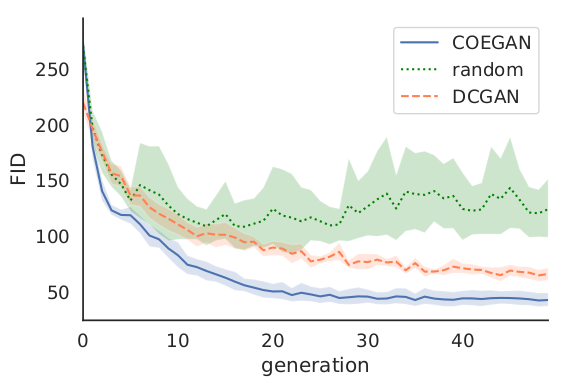
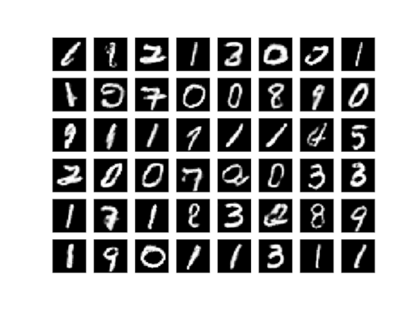
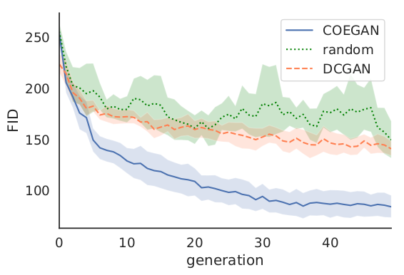
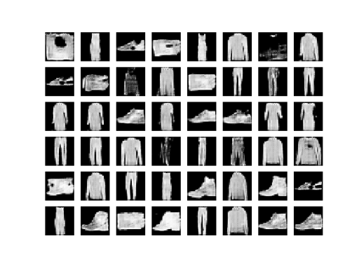

# Introduction

This repository contains the implementation of COEGAN and all code used in the evaluation and comparison with other methods, as presented in the paper COEGAN: Evaluating the Coevolution Effect in Generative Adversarial Networks http://gecco-2019.sigevo.org.

# Environment Setup

Install pytorch:

```
conda install pytorch=1.3.0 torchvision cuda90 -c pytorch
```

Install dependencies:
```
pip install -r requirements.txt
```

## Run All Unit Tests

```
python -m unittest discover
```

# Experiments

## Configure the Training Setup

Edit the experimental settings in `evolution/config.py`.

## Start the Training:
```
python ./train.py
```

## Visualize the Results

Run JupyterLab

```
jupyter lab
```

# Results

See below the results of the experiments presented in the paper:

## MNIST

### Fid Score


### Generated Samples


## Fashion-MNIST

### Fid Score


### Generated Samples

